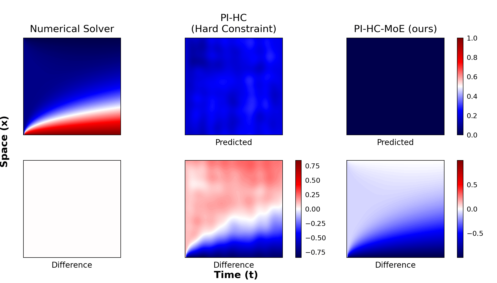

# Scaling Physics-Informed Hard Constraints with Mixture-of-Experts 

Jax implementation accompanying our paper: 

**[Scaling Physics-Informed Hard Constraints with Mixture-of-Experts.](https://openreview.net/forum?id=u3dX2CEIZb)** <br/>
Nithin Chalapathi, Yiheng Du, Aditi Krishnapriyan. ICLR. 2024

Abstract:
> Imposing known physical constraints, such as conservation laws, during neural network training introduces an inductive bias that can improve accuracy, convergence, and data efficiency for modeling physical dynamics.
> While such constraints can be softly imposed via loss function penalties, recent advancements in differentiable physics and optimization improve accuracy by incorporating PDE-constrained optimization as individual layers in neural networks. This enables a stricter adherence to physical constraints, and provides greater control to scale between soft and hard constraints.
> However, imposing hard constraints significantly increases computational and memory costs, especially for complex dynamical systems. This is because it requires solving an optimization problem over a large number of points in a mesh, representing spatial and temporal discretizations, which greatly increases the complexity of the constraint.
> To address this challenge, we develop a scalable approach to enforce hard physical constraints using Mixture-of-Experts (MoE). Our approach imposes the constraint over smaller decomposed domains, each of which is solved by an "expert" through differentiable optimization.
> During training, each expert independently performs a localized backpropagation step by leveraging the implicit function theorem; the independence of each expert allows for parallelization across multiple GPUs.
> Compared to standard differentiable optimization, our scalable approach achieves greater accuracy for predicting the dynamics of challenging non-linear systems. We also improve training stability and require significantly less computation time during both training and inference stages. 



## Installation
All requirements are in ```requirements.txt``` and may be installed via an environment manager of your choice. The entire package can be installed with pip. E.g.,

```bash
pip install -r requirements.txt
pip install -e . # That's it! 
```

The code may be accessed with traditional import statements (```from neptune.geometry import *```) or with our driver script ```train.py``` and ```server_train.py```.

## Running

```train.py``` provides the main driver script for running experiments. By default, all logging is done through wandb; make sure to login with ```wandb login```. Note that any runs with a constraint solver needs FP64 (i.e., ```JAX_ENABLE_X64=True``` environment variable). If you run into memory issues, setting ```XLA_PYTHON_CLIENT_MEM_FRACTION=.90``` can help. You must also change the ```data_root``` variable in ```configs/datasets/diffusion-sorption.yaml``` and ```configs/datasets/navier-stokes.yaml```.

For diffusion sorption:

```bash
# Soft Constraint
python3 train.py -m configs/models/fno2d-64-8m.yaml -d configs/datasets/diffusion-sorption.yaml -t configs/training/ds.yaml
# Hard Constraint
JAX_ENABLE_X64=True python3 train.py -m configs/models/fno2d-64-8m-hard-constraint.yaml -d configs/datasets/diffusion-sorption.yaml -t configs/training/ds.yaml
# MoE
JAX_ENABLE_X64=True python3 train.py -m configs/models/fno2d-64-8m-hard-constraint-moe.yaml -d configs/datasets/diffusion-sorption.yaml -t configs/training/ds.yaml

```

For Navier Stokes 2D:

```bash
# Soft Constraint
python3 train.py -m configs/models/fno3d-64-8m.yaml -d configs/datasets/navier-stokes.yaml -t configs/training/residual-only.yaml
# Hard Constraint
JAX_ENABLE_X64=True python3 train.py -m configs/models/fno3d-64-8m-hard-constraint.yaml -d configs/datasets/navier-stokes.yaml -t configs/training/ns.yaml
# MoE
JAX_ENABLE_X64=True python3 train.py -m configs/models/fno3d-64-8m-hard-constraint-moe.yaml -d configs/datasets/navier-stokes.yaml -t configs/training/ns.yaml
```


## Validation
The validation loop can be run through ```test.py```. Ex:

```bash
python3 test.py [WANDB_RUNID] [WANDB_PROJECT] --batch_size=[BATCH]
```

## Citation
If you found this repository helpful, consider citing our work:

```
@inproceedings{chalapathi2024scaling,
  title={Scaling physics-informed hard constraints with mixture-of-experts},
  author={Nithin Chalapathi and Yiheng Du and Aditi S. Krishnapriyan},
  booktitle={The Twelfth International Conference on Learning Representations},
  year={2024},
  url={https://openreview.net/forum?id=u3dX2CEIZb}
}
```
